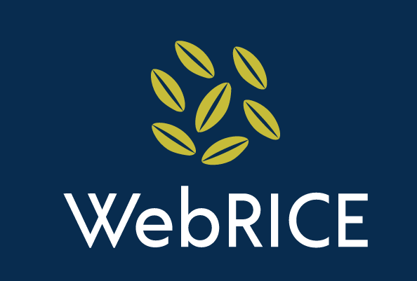

# WebRICE
WebRICE (Web Reader ICE) is an open source web reader in development at
Reykjavik University. We hope that Icelandic developers will add this free
software to their websites to enable Icelandic audiences to listen to the web
instead of reading it.



## Installation
1.  Install packages with: `npm install`
2.  Run with: `npm run dev`

## Usage
To include WebRICE's compiled CSS and JS in your website, add the following lines:

```
<!-- CSS only -->
<link rel="stylesheet" href="http://www.webrice.is/WebRICE_styles.css" crossorigin="anonymous">
```

```
<!-- JavaScript Bundle -->
<script src="http://www.webrice.is/WebRICE.js" crossorigin="anonymous"></script>
```

But WebRICE will only be visible on your site if you add this tag for the WebRICE toolbar:

```
<!-- Div for WebRICE's buttons -->
<div id="webrice"></div>
```

and this id to the HTML tag containing your text.

```
id="webriceTextContainer"
<!-- example <div id="webriceTextContainer"> Text </div>-->
```

A demo of WebRICE can be found at [https://cadia-lvl.github.io/WebRICE](https://cadia-lvl.github.io/WebRICE/).

## Contributing
Use the following linters: eslint and stylelint. They will be run on every pull request.
This project is mainly written in TypeScript. 
Make sure your TypeScript follows the [Google JavaScript style
guide](https://google.github.io/styleguide/jsguide.html), and the [MDN HTML
reference](https://developer.mozilla.org/en-US/docs/Web/HTML/Reference).
Also, validate the generated HTML5 with: https://validator.w3.org/
Then submit a pull request of your changes.

## License
This project is licensed under [Apache 2.0](LICENSE).

## Authors/Credit
[Reykjavik University](https://ru.is)
* Judy Fong [judyfong@ru.is](mailto:judyfong@ru.is)
* Sunneva Þorsteinsdóttir [sunnevath@ru.is](mailto:sunnevath@ru.is)

## Acknowledgements
This project was funded by the Language Technology Programme for Icelandic
2019-2023. The programme, which is managed and coordinated by
[Almannarómur](https://almannaromur.is/), is funded by the Icelandic Ministry
of Education, Science and Culture.

We use icons created from [Material Design](https://www.material.io/).

